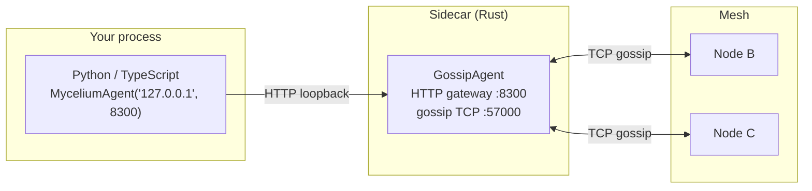

# 10 — Language Bridges: Python and TypeScript

Choose and pin the source with [installation and integration modes](installation.md).

## Concept

Mycelium is a Rust library, but most AI/ML work happens in Python, and much
of the tooling ecosystem is JavaScript/TypeScript. The language bridges solve
this with a **sidecar pattern**: a Rust `GossipAgent` runs as a thin sidecar
process alongside your Python or TypeScript code, exposing the full Mycelium
API over a local HTTP gateway. Your non-Rust code talks to the sidecar over
loopback (measure overhead with [`gateway_overhead`](../../benches/gateway_overhead.rs)) and gets access to every primitive: KV, signals,
capabilities, RPC, consensus, mailboxes.



No PyO3 FFI, no native extension, no version matrix. The sidecar is a
standalone binary (`three_node_demo` in the demo binary or a dedicated
`GossipAgent` in your application). The Python/TypeScript client is a thin
HTTP wrapper — under 500 lines in both cases.

This pattern is demonstrated in `examples/fluid_pipeline/`: 10 Python
workers each connect to their own Mycelium sidecar, advertise capabilities,
and serve RPC calls — all from pure Python.

---

## Python bridge (`mycelium-py`)

### Install

```bash
cd mycelium-py
pip install -e ".[dev]"
# or from PyPI once published:
pip install mycelium-py
```

### Connect

The sidecar must already be running with `MYCELIUM_HTTP_PORT` set (or
`http_port` in a skill TOML). Point the Python agent at its HTTP port:

```python
from mycelium import MyceliumAgent

agent = MyceliumAgent("127.0.0.1", 8300)
```

### Full API

```python
# ── Capabilities ──────────────────────────────────────────────────────────────
handle = agent.advertise_capability("compute", "gpu",
    interval_secs=30, attributes={"model": "A100", "vram_gb": 80})
providers = agent.resolve_capability("compute", "gpu")
# providers: list of {node_id, attributes, ...} dicts
# `handle` keeps the advertisement alive — drop()/context-manage it to retract.
# ⚠️ The refresh loop runs in the NODE, not in your process: if this process
# crashes without drop(), the advert stays live until the node restarts. Bind
# it to YOUR liveness with a lease — the node retracts it unless you heartbeat
# within every lease_secs window (beat at ~lease_secs/3):
leased = agent.advertise_capability("compute", "gpu",
    interval_secs=30, lease_secs=90)
leased.heartbeat()   # every ~30 s from your main loop (async: aheartbeat())

# ── KV store ──────────────────────────────────────────────────────────────────
# Note: no TTL parameter — the store never time-evicts live keys. Liveness
# semantics come from capability evaporation, not from KV expiry.
rcpt  = agent.set("pipeline/job/42", b'{"status": "pending"}')   # KvReceipt: rung 1 always, rung 2 as .local_durability
val   = agent.get("pipeline/job/42")        # bytes | None
items = agent.scan_prefix("pipeline/job/")  # dict[str, bytes]
agent.delete("pipeline/job/42")

# ── RPC ───────────────────────────────────────────────────────────────────────
result = agent.rpc_call(target_node_id, "process", payload_bytes, timeout_secs=30)

async for req in agent.rpc_serve("process"):
    data = json.loads(req.payload)
    response = do_work(data)
    agent.rpc_respond(req, json.dumps(response).encode())

# ── Signals ───────────────────────────────────────────────────────────────────
# Subscribe before emitting: a signal emitted before the stream opens is not delivered to it.
signals = agent.on_signal("task.ready")
first = asyncio.create_task(anext(signals))   # opens the stream
await asyncio.sleep(0.1)                      # let the node register it
agent.emit("task.ready", b"payload", scope="cluster")
agent.emit("task.ready", b"payload", scope="group:workers")   # scope is a string
agent.emit("task.ready", b"payload", scope="node:127.0.0.1:7000")
sig = await first
print(sig.sender, sig.payload)

# ── Mailbox (reliable delivery) ───────────────────────────────────────────────
agent.deliver_event(target_node_id, "task.result", b"done")
async for event in agent.mailbox("task.result"):
    print(event.payload)

# ── Consensus overlay ─────────────────────────────────────────────────────────
agent.consistent_set("config/flag", b"true")   # quorum = majority of peers
val = agent.consistent_get("config/flag")

with agent.distributed_lock("migration-lock", ttl_secs=30) as guard:
    print("fencing token:", guard.token)
    # ... critical section; released on exit (or after TTL on crash) ...

leader  = agent.elect_leader("workers")
hlc     = agent.append("events", b"entry")                  # returns HLC stamp
entries = agent.scan_log("events", from_hlc=0)              # [from_hlc, to_hlc)

# ── A2A / Prompt Skills ───────────────────────────────────────────────────────
from mycelium import A2aClient, PromptSkillClient

a2a    = A2aClient("http://localhost:9050")
skills = a2a.fetch_card()   # list discovered skills
result = a2a.send("llm/orchestrator", "gossip protocols", timeout_secs=120)   # message is a string

ps = PromptSkillClient("127.0.0.1", 8300)                # host, then port
reply = await ps.call("demo", "summarizer", "...")      # async: (ns, name, input)
```

See [`mycelium-py/README.md`](../../mycelium-py/README.md) for the full API
reference including async variants and error handling.

---

## TypeScript bridge (`mycelium-ts`)

### Install

```bash
cd mycelium-ts
npm install && npm run build
# or from npm once published:
npm install mycelium-ts
```

### Full API

```typescript
import { MyceliumAgent } from "mycelium-ts";

const agent = new MyceliumAgent("127.0.0.1", 8300);

// ── Capabilities ──────────────────────────────────────────────────────────────
const handle = await agent.advertiseCapability("compute", "gpu", {
    intervalSecs: 30,
    attributes: { model: "A100", vram_gb: 80 },
});
const providers = await agent.resolveCapability("compute", "gpu");
// Same liveness rule as Python: without a lease the NODE keeps the advert
// alive even if this process crashes. Pass leaseSecs and heartbeat within
// every window (beat at ~leaseSecs/3) to bind it to this process instead:
const leased = await agent.advertiseCapability("compute", "gpu", {
    intervalSecs: 30, leaseSecs: 90 });
await leased.heartbeat();   // a missed window retracts the advert node-side

// ── KV store ──────────────────────────────────────────────────────────────────
// No TTL option — the store never time-evicts live keys.
const rcpt  = await agent.set("pipeline/job/42", Buffer.from('{"status":"pending"}')); // KvReceipt: rung 1, rung 2 as .localDurability
const val   = await agent.get("pipeline/job/42");      // Buffer | null
const items = await agent.scanPrefix("pipeline/job/"); // Record<string, Buffer>
await agent.delete("pipeline/job/42");

// ── RPC ───────────────────────────────────────────────────────────────────────
const reply = await agent.rpcCall(targetNodeId, "process", payload, { timeoutSecs: 30 });

for await (const req of agent.rpcServe("process")) {
    const result = doWork(req.payload);
    await agent.rpcRespond(req, Buffer.from(JSON.stringify(result)));
}

// ── Signals ───────────────────────────────────────────────────────────────────
// Subscribe before emitting: a signal emitted before the stream opens is not delivered to it.
const sub = agent.onSignal("task.ready");
const next = sub.next();                         // opens the stream
await new Promise((r) => setTimeout(r, 100));    // let the node register it
await agent.emit("task.ready", Buffer.from("payload"), { scope: "cluster" });
await agent.emit("task.ready", Buffer.from("payload"), { scope: "group:workers" });
const { value: sig } = await next;
console.log(sig!.sender, sig!.payload.toString());
await sub.return(undefined);

// ── Consensus overlay ─────────────────────────────────────────────────────────
await agent.consistentSet("config/flag", Buffer.from("true")); // quorum = peer majority
const flagVal = await agent.consistentGet("config/flag");
const guard   = await agent.distributedLock("migration-lock", { ttlSecs: 30 });
// ... critical section (guard.token is the fencing token) ...
await guard.release();
const leader  = await agent.electLeader("workers");
const hlc     = await agent.append("events", Buffer.from("entry")); // bigint HLC, exact
const entries = await agent.scanLog("events", { fromHlc: 0n });   // [fromHlc, toHlc)
// 64-bit values are exact from mycelium-ts 0.2.0: an HLC is above 2^53, and earlier versions
// rounded it (two HLCs one tick apart compared equal). Timeouts are whole seconds, rounded up.

// ── A2A / Prompt Skills ───────────────────────────────────────────────────────
import { A2aClient, PromptSkillClient } from "mycelium-ts";

const a2a    = new A2aClient("http://localhost:9050", { timeoutMs: 120_000 });
const skills = await a2a.fetchCard();
const result = await a2a.send("llm/orchestrator", "gossip protocols");   // message is a string

const ps      = new PromptSkillClient("127.0.0.1", 8300);                // host, then port
const summary = await ps.call("demo", "summarizer", "...");               // (ns, name, input)

// ── Clean up ──────────────────────────────────────────────────────────────────
await handle.drop();
```

**Requires Node.js ≥ 18.** See [`mycelium-ts/README.md`](../../mycelium-ts/README.md)
for the full reference including SSE streaming and error types.

---

## Declaring a unit file from Python or TypeScript

A Rust node reads its unit file at start. An SDK agent has no such start, so it hands the file's
text to its node instead. The node parses and validates it with its own loader — the same file
`mycelium wire-check` reads — and declares the unit's `[[capability]]`, `[[requirement]]` and
`[[group]]` sections under **one handle**. The SDKs carry text; neither ships a TOML parser.

The verbs:

| SDK | Call | Returns |
|---|---|---|
| `mycelium-py` | `agent.declare_units(toml_text, *, interval_secs=30, lease_secs=None)` | `UnitHandle` with `principal`, `declared`, `not_enforced` |
| `mycelium-py` | `agent.declare_from(path, **kwargs)` — reads the file, then `declare_units` | the same |
| `mycelium-ts` | `agent.declareUnits(tomlText, { intervalSecs?, leaseSecs? })` — read the file yourself | `UnitHandle` with `principal`, `declared`, `notEnforced` |

Both call `POST /gateway/units/declare`, scope `cap:write`
([rbac.md](../operations/rbac.md)). The body is `{"toml": "…", "interval_secs": n, "lease_secs"?: n}`;
the answer is

```json
{"handle_id": "…", "principal": "coop-matcher",
 "declared": {"capabilities": 1, "requirements": 1, "groups": 0},
 "not_enforced": ["[[lane]]"]}
```

What the node refuses, and what it only records (`gw_units_declare`, `src/agent/http.rs`):

- **400** — the text is not TOML, or the unit file's own `validate()` refuses it (an empty
  `principal`, a bad constraint operator, a `[[mandate]]` with no operations, …). Nothing is
  declared: the node converts every section before it declares any.
- **422** — the file has a hosting section: `[hosts]`, `[[presence]]`, `[[activation]]` or
  `[[serve]]`. Those belong to a stem (`mycelium-stem`); an SDK agent hosts nothing.
- **Accepted, not enforced** — `[[lane]]`, `[[mandate]]` and `[[rule]]` are taken as declarations
  and named in `not_enforced`. They inform `wire-check`; the node does not act on them.
- A `[[capability]]`'s `probe_url` is not run on this path: the capability is advertised as
  declared, for as long as the handle lives.

`drop()` sends `DELETE /gateway/capability/{handle_id}` and retracts the whole unit — every
capability, requirement and group it declared. Without `lease_secs` the node keeps re-asserting the
unit until that `DELETE` or a node restart, even if your process dies. With `lease_secs`, call
`heartbeat()` within every window (about a third of it is a safe beat); a missed window retracts
the unit as `DELETE` would.

A food-redistribution co-op's matcher, as a unit file (`units/matcher.toml`):

```toml
principal = "coop-matcher"

[[capability]]
ns = "food"
name = "match"
ttl_secs = 30
  [capability.attrs]
  region = "north"

[[requirement]]
ns = "food"
name = "surplus-feed"
  [requirement.attrs]
  region = "north"

[[lane]]
name = "pickups"
role = "produces"
```

From Python:

```python
from mycelium import MyceliumAgent

agent = MyceliumAgent("127.0.0.1", 8300)
with agent.declare_from("units/matcher.toml", lease_secs=30) as unit:
    print(unit.principal, unit.declared, unit.not_enforced)
    # coop-matcher {'capabilities': 1, 'requirements': 1, 'groups': 0} ['[[lane]]']
    ...  # do the work; call unit.heartbeat() about every 10 s
# leaving the block calls unit.drop(): the whole unit is retracted
```

From TypeScript:

```ts
import { readFile } from "node:fs/promises";
import { MyceliumAgent } from "mycelium-ts";

const agent = new MyceliumAgent("127.0.0.1", 8300);
const unit = await agent.declareUnits(await readFile("units/matcher.toml", "utf8"), { leaseSecs: 30 });
console.log(unit.principal, unit.declared, unit.notEnforced);
const beat = setInterval(() => void unit.heartbeat(), 10_000);
// … on shutdown:
clearInterval(beat);
await unit.drop();
```

The unit-file sections are described in [the unit-file reference](../reference/unit-file.md); how a
unit file is checked, deployed and watched is
[the capability lifecycle](../operations/capability-lifecycle.md).

## The HTTP surface behind the SDKs — and what it does not return

A raw-HTTP client (or an SDK reader checking what a verb really does) needs the routes and their
shapes; the SDK READMEs carry the receipt narrative, this table carries the wire (`src/agent/http.rs`):

| Route | Body → answer | What it proves |
|---|---|---|
| `GET /gateway/kv?key=K` | → `{"found": true, "value_b64": "…"}` or `{"found": false}` | a local read |
| `POST /gateway/kv` | `{"key", "value_b64"}` → `{"ok": true, "operation_id", "local_durability", "local_durability_error"?}` | the write's **receipt**: rung 1, and rung 2 as `local_durability` (`on_disk` · `buffered` · `not_configured` · `failed`, the SDKs' vocabulary) — added 2026-09-26; before it the route answered a bare `{"ok": true}`; a missing `value_b64` is **400 and no mutation** since 2.14.0; `""` writes an empty value |
| `POST /gateway/kv/quorum` | `{"key", "value_b64", "min_acks", "timeout_secs"}` → `{"ok", "acks_received"}` or `{"ok": false, "error": "timeout", "acks_received", "unknown_peers"}` | rung 3: `unknown_peers` is *silence*, not refusal — `DeliveryUnknown` in the receipt vocabulary |
| consensus commits (`/gateway/overlay/consistent/set`, …) | → `{…, "persisted", "local_durability", "local_durability_error"?}` | rung 2 for the commit; `persisted: false` with `local_durability_error` says why |
| `GET /gateway/signal/sse/{kind}` | SSE; event name = the kind; data `{"kind", "sender", "payload_b64", "nonce"}` (`kind` in the data since 2.24.0; `nonce` is a u64 — parse it losslessly) | delivered to **this** subscriber. The node holds at most 256 undelivered signals per subscription and drops past that, logging `Signal handler channel full; signal dropped` — signals are best-effort |
| `GET /signals/{kind}` | the same event; data `{"kind", "sender", "payload"}` — base64 under `payload`, no `nonce` | as above |

Scopes: `kv:read` for the GET, `kv:write` for both POSTs; `mesh:read` for the two signal streams
([rbac.md §2](../operations/rbac.md)).

## Authenticating to a token-protected gateway

Any node exposed beyond loopback should carry `gateway_auth_token` (or scoped tokens / OIDC —
[operations/rbac.md](../operations/rbac.md)); it then answers every `/gateway/*` route, and the
node-level `/mcp`, `/signals/{kind}`, `/consensus/{slot}`, with `401` unless the request bears
`Authorization: Bearer <token>`. Both bridges take the token at construction and fall back to the
`MYCELIUM_GATEWAY_TOKEN` environment variable; it rides every request, SSE streams included.

```python
agent = MyceliumAgent("10.0.0.5", 8300, token="…")        # mycelium-py ≥ 0.2.4
```
```ts
const agent = new MyceliumAgent("10.0.0.5", 8300, 30_000, { token: "…" }); // mycelium-ts ≥ 0.1.1
```

Companion handles (`Wiki`, `TupleSpace`, `Blackboard`, `PromptSkillClient`, `ReasonClient`,
`A2aClient`) take the same option. Under scoped tokens, grant the route families the client
uses (`kv:*`, `mesh:*`, `wiki:*`, `tuple:*`, …). Before these versions the bridges could not
present a bearer at all — a token-protected node was unreachable from Python and TypeScript.

## The sidecar in practice — fluid pipeline

`examples/fluid_pipeline/` is the reference implementation of language bridge
usage at scale. Each Python worker:

1. Starts with `MYCELIUM_PEERS` pointing at the coordinator's gossip port
2. Runs a Mycelium sidecar (embedded in the Docker image)
3. Connects via `MyceliumAgent("127.0.0.1", 8300)`
4. Advertises four capabilities (`advertise_capability("stage_a", "worker")`
   through `("stage_d", "worker")`, each on a 15 s interval)
5. Serves RPC calls via `async for req in agent.rpc_serve(method)`

The coordinator resolves workers via `agent.resolve_capability("stage_a",
"worker")`, dispatches via `agent.rpc_call(...)`, and writes results to the
KV ring — all from Python. The Mycelium substrate handles gossip,
anti-entropy, and capability evaporation transparently.

---

## Dev Notes

**Starting the sidecar.** In `fluid_pipeline`, the sidecar is started as part
of the Docker image entrypoint. For standalone use, run any Mycelium binary
with `MYCELIUM_HTTP_PORT` set and point the SDK at that port. The
`three_node_demo` binary's `node` role is the simplest sidecar — just a
`GossipAgent` with an HTTP gateway and no application logic.

**Port mapping.** The HTTP gateway port is what the SDK connects to. The
gossip TCP port is what mesh peers connect to. Keep them separate:
`MYCELIUM_HTTP_PORT=8300` (SDK) and `MYCELIUM_PORT=57000` (mesh).

**Async patterns.** Both SDKs are async-first. Python uses `asyncio`
(`async for req in agent.rpc_serve(...)`); TypeScript uses `for await`.
For synchronous Python scripts, use `asyncio.run()` or the sync wrappers
where provided.

**When to use the language bridge vs Rust directly.** Use the language bridge
when:
- Your team writes primarily in Python/TypeScript
- You're integrating Mycelium into an existing ML pipeline or web service
- You want to avoid a Rust compilation step in your deployment

Use Rust directly when:
- You need maximum throughput (no HTTP hop, no serialization)
- You're embedding Mycelium inside a larger Rust service
- You need `--features tls` (mTLS is only available in the Rust binary, not
  via the HTTP gateway)

**SDK method count.** `mycelium-py` and `mycelium-ts` each mirror 28+ methods
from the Rust API. Both are maintained in sync with the Rust library and
tested in the integration scenario suite.
