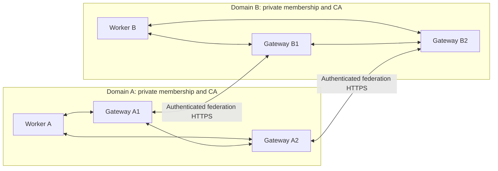

> **Vendored external review artefact — third-party, 2026-09-05. Body unmodified.**
> Our assessment, adopted elements and every divergence: [`../v3-contracts-axis.md`](../v3-contracts-axis.md) §5 and §7 (decision register).
> Do not edit below this line; changes to our plan go in `v3-contracts-axis.md`.

---

# Bounded, federated coordination domains: design and implementation plan

Status: proposal, not implemented. Prepared 2026-09-05 against Mycelium HEAD `4742356` and the working tree inspected during this task. Preserve existing uncommitted work. Recheck the baseline before implementation.

## 1. Architectural decision

A coordination domain is one independently admitted gossip mesh. It owns its transport membership, KV replication, signal dissemination, local policy, and consensus membership. Federation connects explicitly exported services and summaries between domains over a separate application protocol. It does not join their gossip transports.

Start with one domain per node process. The first demonstration uses three processes in each domain: one worker and two gateway peers. Each gateway belongs to exactly one mesh, holds only that mesh's membership credentials, and reaches foreign gateways using HTTPS. Gateways are replaceable application roles, implemented by an embeddable companion library; a separate global control-plane service is unnecessary.



Within each mesh, preserve existing forwarding semantics: action scopes do not become transport filters. Existing TTL, deduplication, and transport backpressure still apply. Crossing a domain boundary requires export, import, authorization, and resource admission. A remote service can influence local application decisions through an approved result, but its nodes never become local voters or gossip members.

## 2. What the first release guarantees

- A and B can run local work independently, including throughout loss of every federation connection.
- Only explicitly projected exports and authorized call inputs/results cross the federation interface.
- Foreign catalogs never populate native `cap/`, `grp/`, `sys/`, `consensus/`, membership tables, or anti-entropy state as if they originated locally.
- Each operation names its source domain, origin principal, destination domain, export, schema/version, authority, and expiry.
- At least two independently addressable gateways can serve each domain. New calls can use a surviving gateway without electing a federation leader.
- Discovery can become stale; authorization cannot silently become more permissive because a link is down.
- Federation's queues, ingress, retries, and provider work are bounded. Their configured failure and resource boundaries are measured, not inferred from the existence of a domain label.

Scope limitations: cooperative local members; authenticated but potentially abusive foreign clients; independent domains rather than mutually distrustful tenants within one process; direct A–B federation only; bounded unary calls to explicitly repeatable/read-only services. Arbitrary side effects require the separate operation/effect contract plan before automatic failover retries are enabled. A compromised trusted local member can still leak data it holds; an export layer does not eliminate that insider capability.

## 3. Existing mechanisms and important gaps

| Existing surface | Reuse | Required change or qualification |
|---|---|---|
| `mycelium-core/src/config.rs` | Per-node transport, resource, bootstrap, and TLS configuration | `cluster_name` is explicitly only a label. Add an enforced domain profile with validated identity/config binding. |
| `mycelium-core/src/tls.rs` | Separate intra-domain mTLS admission roots | Never install foreign federation trust anchors into gossip `RootCertStore`. |
| `mycelium-core/src/swim.rs` | Local failure detection | UDP membership traffic is separate from TCP TLS. Disable SWIM in the first enforced profile; authenticated domain-bound UDP admission is later work. |
| `mycelium-agentfacts` | Signed facts, schema projection concepts, edge discovery | An embedded-key signature proves integrity, not permission to represent a trusted domain. The existing full domain board is not a safe default export. |
| `src/agent/capability_handle.rs` | Select local providers using their existing authorization and freshness rules | Foreign handles must remain a separate type/resolver. |
| `src/agent/service_handle.rs`, `rpc.rs` | Local request/reply machinery | Preserve caller evidence in a federation-aware provider adapter; do not proxy arbitrary kinds using a gateway's broad local authority. |
| `src/agent/http.rs` | HTTP infrastructure | Use a dedicated bounded federation listener for the isolation demo. Do not assume existing `/gateway` authentication covers a new path. |
| `examples/coop/src/bin/federation_facts.rs` | Existing two-domain discovery demonstration | Extend with export policy, invocation, two gateways per side, partition/reconnect and isolation assertions. |

The first version deliberately avoids a core wire-version change. This is valid only with distinct pinned membership roots, the enforced deployment profile, and SWIM disabled. A domain name in a packet or configuration file is not cryptographic separation.

## 4. Domain identity and configuration

Proposed domain model:

```rust
struct DomainId(/* stable identifier bound to genesis authority */);
struct DomainDescriptor {
    domain_id: DomainId,
    authority_epoch: u64,
    membership_ca_fingerprint: Digest,
    principal_issuers: Vec<KeyId>,
    gateways: Vec<GatewayIdentity>,
    protocol_versions: Vec<ProtocolVersion>,
    valid_until: Timestamp,
}

struct DomainPolicy {
    revision: u64,
    exports: Vec<ExportRule>,
    imports: Vec<ImportRule>,
    grants: Vec<InboundGrant>,
    budgets: BudgetPlan,
    valid_until: Timestamp,
}
```

Bind a stable domain ID to its genesis public authority record; keep display names separate. Root and gateway rotation must not rename the domain. Descriptor/policy updates are signed, revisioned, and persisted with their highest accepted epochs. Reusing an epoch with different contents is an error. Genesis trust is installed explicitly by each operator; do not silently trust the first document fetched.

The domain's administrative authority can be an operator signing configuration offline. It is not a mandatory per-call coordinator or a shared authority over A and B. The initial release supports operator-issued bundles, planned overlapping key rotation, and explicit out-of-band recovery if a root is compromised. Cross-signing by a compromised old key alone is not recovery.

The new domain builder validates:

- configured membership root matches the signed descriptor;
- TLS is enabled and foreign membership roots are absent;
- bootstrap nodes belong to the intended configured mesh; remote TLS admission still verifies every connection;
- SWIM is disabled in the enforced v1 profile;
- state directories, node credentials, and gateway slots are isolated;
- all export/import lists default to empty;
- budget allocations and policy lifetimes are valid.

Ship a construction API that validates before starting owned node instances. Attaching to an arbitrary already-running agent may be offered only as an explicitly weaker integration profile, not as certified domain isolation. If public configuration inspection is missing, add a narrow immutable snapshot accessor; do not expose `TaskCtx` to the companion.

## 5. Trust and authorization: three different relationships

1. **Membership trust:** a local node may join A's gossip mesh. This trust stays inside A.
2. **Federation identity trust:** B recognizes A's descriptor/principal issuers and specified gateway keys. This does not make A's members part of B.
3. **Service authorization:** B permits a named A principal or narrowly defined principal class to invoke a particular B export under stated limits. Discovery does not grant this permission.

Keep these stores and verifier entry points separate. A self-signed AgentFacts document not anchored in an accepted domain descriptor remains untrusted metadata.

Requests have an origin-signed intent plus a gateway-authenticated transport hop. Origin credentials bind the principal key to its source domain; B accepts those credentials only under its configured issuer policy. Validate possession of the origin key, intended audience, export, operation, schema, payload digest, validity interval, and request ID. A's egress policy and B's admission policy both apply. B may reject regardless of A's approval.

On B, the local provider sees `FederatedCaller { source_domain, principal, credential, request_digest, gateway_chain, granted_scope }`, not an invented native sender. A federation-aware adapter validates B's export authorization and preserves evidence to the handler. The gateway may select only locally configured export mappings, never an arbitrary user-supplied RPC kind, node address, SQL string, or admin capability.

Enforce the same rule in any legacy adapter: it is a scoped local principal for precisely that export, with the foreign actor retained as attributable context. It cannot borrow unrestricted gateway identity. Local members remain in the documented trusted-member model; do not claim the adapter prevents every action by a compromised local peer.

## 6. Discovery is a filtered, attributable projection

Introduce `ExportId`, distinct from local capability name and provider node identity. A local rule maps an export to eligible local providers and an explicitly approved public schema. Provider identities, internal addresses, local group topology, and unrestricted metadata remain private.

Each authenticated partner receives an audience-specific signed catalog containing:

- source domain and serving gateway;
- policy revision and descriptor digest;
- gateway-local durable catalog sequence and issue/expiry times;
- export IDs, public schema hashes, supported call semantics, and permitted endpoints;
- approved summary values, observation interval, units, and view confidence;
- explicit completeness scope and withdrawals where available.

Use a projection allowlist, not a list of fields to redact. Do not publish the current full AgentFacts domain board automatically. A minimal public well-known descriptor may list identity, protocol, and contact endpoints; capability catalogs are partner-authenticated by default. Public exports are a separate deliberate policy choice.

Catalogs are observations, not global truth. Two gateways may legitimately see different local providers. Sequences are ordered per gateway, not compared as one global counter. A missing export in a partial catalog does not delete another gateway's valid observation. Authorization is rechecked at invocation, independently of cached discovery.

Do not restart TTLs when copying or receiving a catalog. Bound acceptance by signed expiry, policy/credential expiry, and locally allowed maximum age. Persist rollback protection; on loss of its trusted local state, a gateway must re-bootstrap rather than accept arbitrary historic catalogs. Define bounded clock skew; if time trust is lost, stop federation admission while local mesh work continues.

Store foreign observations in the companion's bounded local cache. Workers query a local federation gateway via an explicit resolver. Optional intra-domain dissemination of small foreign summaries is a later feature; it must retain source identity and original expiry and can never install foreign entries in native discovery. Import-to-export is prohibited in v1, avoiding A→B→A amplification and authority laundering.

## 7. Invocation protocol and application API

Illustrative API; exact names to settle in the first ADR:

```rust
let remote = federation.resolve(&domain_b, "routing/optimize").await?;
let outcome = federation.call(
    &remote,
    caller_signed_request,
    CallOptions { deadline, retry: RetryPolicy::RepeatableOnly },
).await?;
```

A `RemoteCapability` carries a domain-qualified export and catalog evidence. It cannot be passed to native `service().rpc_call` as a local `NodeId`. Local and remote resolution remain separate for v1; an application may explicitly compose a preference order.

Request envelope: protocol/type tag; immutable request ID; signed origin; source and destination domain IDs; export and method; schema hash/version; exact payload digest; issued/not-before/expiry times; deadline; bounded provenance chain; authority references. Gateways never extend the origin's deadline. The caller's signed intent addresses the destination domain/export so a retry may use another authorized gateway; a fresh hop signature binds each actual HTTPS endpoint.

Response: request digest/ID; source destination-domain identity; export/schema; outcome; result digest; destination authorization revision and gateway attestation. Reject responses for another request, tenant, domain, or schema. Strip internal stack traces and addresses from remote failures.

Protocol endpoints on a dedicated listener:

- `GET /.well-known/mycelium-domain`: deliberately public minimal descriptor, if enabled.
- `GET /federation/v1/catalog`: authenticated audience-filtered catalog.
- `POST /federation/v1/call`: authenticated, bounded unary invocation.
- `GET /federation/v1/status/{request_id}`: optional same-principal status with explicit local evidence scope; missing state is not proof of non-execution.

Use HTTPS and standard signed-envelope encodings. Proposed profile: JWS for persistent descriptor/catalog/origin objects; RFC 9421 HTTP signatures for the transport hop, covering method, authority/target, content digest, created/expiry and nonce. Pin algorithm allowlists and key purposes; verify digest against received bytes. Use a tested implementation and cross-language test vectors. Canonical JSON (RFC 8785) is needed only where a content-addressed digest is derived from a semantic JSON object; do not confuse reserialized JSON with the bytes a JWS actually signs. Encode large IDs/epochs as strings in the interoperable schema.

V1 outcomes distinguish `RejectedBeforeDispatch`, `UnavailableBeforeDispatch`, `RateLimited`, `DeadlineExceededBeforeDispatch`, `Completed`, and `DeliveryUnknown`. A connection loss or timeout after dispatch does not mean the provider did nothing. No generic transparent retry for arbitrary MCP/A2A operations.

## 8. Multiple gateways, replay, and recovery

Advertise multiple independently reachable gateways in each descriptor. Select using bounded health observations and local capacity; apply jittered retries and cooldowns. No gateway is the owner of the domain catalog. Same-domain ingress gateways can route the same export to eligible local providers.

Cache nonces and request identities within bounded windows. Verify original expiry across gateway replacement and restart. Memory-only per-gateway deduplication does not establish global at-most-once execution. V1 permits duplicate execution only of exports explicitly certified repeatable/read-only. Every execution attempt consumes the applicable admission budget. Stateful exports fail configuration validation until a destination-level idempotency/status contract exists.

For effectful v2 exports, integrate the earlier stable-operation-ID and destination-commit plan. Deduplication must span all gateways/providers that can execute the operation; a fresh gateway-local result cache is insufficient. Persisted replay state can use typed local durability once that work lands, but discovery/read-only v1 does not need to wait for replicated-durability implementation.

Replacement gateways use unique identities unless restoring the same exclusively owned persistent gateway slot. Rotation is accepted only via the trusted descriptor chain. Independent gateways can keep serving under their still-valid policies without a live leader.

Revocation is bounded, not instantaneous during disconnection. A gateway that learns a newer revocation/policy rejects immediately. One isolated with older valid authority can act only until its signed policy/credential lease expires; it cannot renew that lease itself using a mere gateway key. Policy bundles therefore need renewal by the domain's authorized administrative signer(s) before expiry. Failure to renew disables federation, not local mesh operations. The maximum stale-authorization interval is part of the published contract. Higher-risk deployments can require fresh online approval and accept reduced cross-domain availability.

On reconnect: validate descriptor/key continuity and policy epochs, refresh catalogs, retire expired/withdrawn exports, then admit new work. Do not flush queued calls automatically, extend deadlines, or resume stale authorizations. There is no cross-domain KV merge, member merge, or consensus-log reconciliation.

## 9. Resource and failure boundaries

Use finite limits at each stage: TLS/connection admission, headers/body bytes, decoded fields/nesting, catalog entries/cache bytes, concurrent calls, waiting queue, request/response size, provider execution deadline, and retries. Check cheap limits before expensive signature verification; reserve separate capacity for local work and local diagnostics.

Enforce both source egress and destination ingress budgets per partner/export, with a domain-configured aggregate ceiling. V1 divides that ceiling into fixed gateway-slot allocations whose rates and bursts sum to the permitted total. Slots use distinct credentials, exclusively owned persistent quota state, and bounded provider allocations. No automatic borrowing or reallocation when a gateway disappears. Safe replacement must fence the previous slot holder; without that evidence, use a separately reserved slot or wait. A deployment that clones slot credentials/state cannot claim the aggregate guarantee.

State the scope of each limit: per-process memory, per-slot throughput, per-provider execution, and total provisioned-domain capacity. Ordinary token buckets do not implement a strict global spend budget across partitions. Such budgets require allocated rights or a coordinated ledger and are deferred to the contracts work.

For the release demonstration, run gateway processes with explicit OS/container CPU, memory, and connection limits and provider handlers with separate concurrency pools. A timeout cannot stop uncooperative synchronous code; exports requiring hard execution limits must run in a cancellable sandbox/worker process. Sharing a physical host/network link still shares that failure domain. Deploy the two domains independently for the strong isolation demonstration.

Proposed smoke-test settings, to be tuned rather than advertised as production sizing: catalog refresh 10 seconds with jitter; signed catalog life at most 30 seconds; maximum clock skew 2 seconds; 256 KiB unary request/result ceiling; 8 concurrent remote calls and 16 queued calls per gateway; 2 alternate-gateway attempts for repeatable calls within one 5-second caller deadline. Total domain allocations are explicit sums. Credentials and policy leases have separately declared expiry bounds.

## 10. Layering and file layout

New optional companion `mycelium-federation`:

- `domain.rs`: descriptor, enforced builder, local identity binding.
- `trust.rs`: credential validation, accepted issuers, rotation, rollback/revocation handling.
- `policy.rs`: typed import/export/grant rules and revision validation.
- `catalog.rs`: allowlist projection, cache, per-gateway sequences and expiry.
- `protocol.rs`: versioned envelopes and validation vectors.
- `client.rs`, `gateway.rs`: edge transport, authentication and explicit routing.
- `provider.rs`: federation-aware local handler context and export adapters.
- `budget.rs`: bounded admission, static allocations, retry controls.
- `storage.rs`: local cache/replay/high-water persistence and exclusive slot ownership.
- `diagnostics.rs`: provenance and bounded-cardinality metrics.

Reuse `mycelium-agentfacts` models/serialization adapters where they fit; do not make its public endpoints silently change meaning. Add a filtered builder if useful. The federation profile owns its independent protocol version and trust semantics, not NANDA field names.

Core changes are restricted to a validated immutable configuration accessor or generic admission hooks actually required by integration. No foreign-domain condition in the signal-forwarding loop. Do not introduce a core federation dependency. Authenticated UDP/domain-bound handshake evolution, if later pursued, is its own wire-compatibility milestone.

Document both a library-hosted deployment and the isolated gateway process example. An embedding can choose shared fate; it must not inherit the example's process-isolation claim merely by using the library.

## 11. Implementation sequence

| PR | Deliverable | Completion gate |
|---|---|---|
| 1 | Domain ADR, enforced profile, baseline two-mesh harness | Separate roots/state; SWIM disabled; cross-root bootstrap fails; normal intra-domain forwarding unchanged |
| 2 | Domain identity, trust bundles, typed policy and protocol vectors | Embedded-key forgery, wrong audience, stale/conflicting epoch and unsupported algorithms fail |
| 3 | Filtered catalogs and explicit remote resolver | Secret canaries absent; source provenance and expiry preserved; imported records do not enter local membership |
| 4 | Authenticated unary calls and provider adapter | Origin and destination policy checked; no arbitrary RPC/admin dispatch; altered origin/body rejected |
| 5 | Two-gateway operation, bounded budgets and failure outcomes | Gateway loss, abusive traffic, retry storms and ambiguous timeout tests pass |
| 6 | Partition/reconnect, revocation expiry and rotation | Old policy cannot revive on reconnect; independently progressing local meshes; no implicit replay |
| 7 | Runnable example, SDK schema/clients, diagnostics and docs | Reproducible acceptance scenario and cross-language signature/ID fidelity |

PRs 1–3 produce a useful authenticated discovery release. Invocation is ready only after PRs 4–6 pass together. PR 7 completes the intended first implementation. Changes to authenticated SWIM, transitive federation, streaming/bulk payloads, dynamic quota transfer, and effectful retries are separate follow-on milestones.

## 12. Required acceptance scenario

Start A1/A2/A-worker and B1/B2/B-worker using separate membership roots, separate state, and two federation endpoints on each side. All six use the enforced domain profile. The local workers expose a deterministic repeatable service; B exports one public schema and a small approved summary, withholding an internal service and secret KV canaries. Federation grants are bilateral and explicit.

1. A discovers only B's authorized export; B independently discovers A's chosen export.
2. A invokes B and verifies a response bound to the original principal/request; B's handler sees foreign provenance.
3. Kill B1. New repeatable calls succeed through B2; no global election or shared CA is required.
4. Block all A–B traffic. Both local meshes keep accepting local writes, exchanging local signals, and making independently configured local consensus decisions.
5. Catalogs expire; remote calls return bounded explicit failures. Local capability resolution never substitutes a foreign node into membership or quorum.
6. Revoke an export/key in B during the partition. Test both immediate rejection where the new policy is known and cessation by the old authority's expiry where it is not.
7. Reconnect. Fetch current signed state, reject rolled-back catalogs, and use only current permissions. Expired requests stay expired.
8. Restore B1 from old disk state and test rollback/lease expiry. Introduce a new gateway with a valid descriptor update and test planned rotation.
9. Flood federation requests and huge/invalid catalogs. Assert configured queue/memory bounds, finite retries, and a measured local-service latency budget under the test workload.
10. Inspect network traces and internal membership/consensus state: no cross-domain gossip/SWIM connections, no foreign voter IDs, no raw private KV or unauthorized schema canaries in catalogs/logs/responses.

Additional adversarial tests: forged self-signed domain with the same display name; peer from the wrong root; altered body or destination; replayed origin proof through another gateway; attempts to call internal admin capabilities; server redirects/DNS changes toward forbidden destinations; same request ID with different content; clock rollback; expired certificates/policy; policy conflict at equal revision; simultaneous gateway restart; duplicate quota-slot start; disappearance of all gateways; partner metadata cardinality attacks.

Catalog/body hashes and complete principal identifiers belong in bounded traces or audit records, not metrics labels. Audit admission/denial, policy revision, route choice, retries and outcome without logging secret payloads or bearer credentials. Request-status lookup requires the same origin authorization as execution.

## 13. Decisions made and residual questions

Made for v1: one domain per process; separate membership roots; SWIM disabled; explicit trust bootstrap; direct federation; private partner catalogs by default; separate remote handles; repeated read-only execution permitted; effectful retry disabled; static quota slices; bounded stale authorization; no automatic backlog replay.

To resolve through PR 1/2 evidence: exact signed-object library, storage backend for replay/high-water state, documented platform storage/clock assumptions, and measured provider/federation resource allocations. These are implementation selections, not reasons to leave domain semantics ambiguous. Existing foreign federation integrations need an explicit migration to trusted descriptors; old self-certified discovery remains available under its existing weaker contract.

## References and relationship to earlier work

- Local sources: `docs/guide/17-federation.md`, `mycelium-agentfacts/README.md`, `mycelium-core/src/config.rs`, `mycelium-core/src/swim.rs`, `src/agent/{rpc,service_handle,capability_handle,capauthz}.rs`.
- [RFC 9421: HTTP Message Signatures](https://www.rfc-editor.org/rfc/rfc9421.html): hop authentication coverage and replay considerations.
- [RFC 7515: JSON Web Signature](https://www.rfc-editor.org/rfc/rfc7515.html) and [RFC 8725: JWT Best Current Practices](https://www.rfc-editor.org/rfc/rfc8725.html): signed-object encoding and strict algorithm/issuer/audience validation when JWT credentials are used.
- [RFC 8785: JSON Canonicalization Scheme](https://www.rfc-editor.org/rfc/rfc8785.html): deterministic semantic-JSON digests, where needed.
- The separate invariants/failure-semantics implementation plan supplies durable operation receipts and destination-side effect deduplication for a later effectful federation profile. Domain isolation and repeatable-service federation can ship first.
