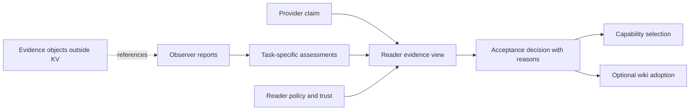

> **Vendored external review artefact — third-party, 2026-09-05. Body unmodified.**
> Our assessment, adopted elements and every divergence: [`../v3-contracts-axis.md`](../v3-contracts-axis.md) §6.1 and §7 (decision register).
> Do not edit below this line; changes to our plan go in `v3-contracts-axis.md`.

---

# Assertions, observations, and accepted knowledge: design and implementation plan

Status: proposal, not implemented. Prepared 2026-09-05 against Mycelium HEAD `91f8be1`. Recheck the working tree before implementation. The first deliverable is evidence-aware capability resolution; broader wiki/federation integration follows the same vocabulary without blocking it.

## 1. Architectural decision

Add an optional application-layer companion, provisionally `mycelium-knowledge`. It stores attributable, immutable records, links their supporting evidence, and constructs reader-specific acceptance views. Core continues to propagate opaque bytes and resolve mutable operational state through LWW.

The decisive separation is between:

- **What a participant says:** a claim.
- **What a participant reports encountering:** an observation, including its method and context.
- **What a participant infers:** an assessment derived from specified evidence.
- **What a reader or institution adopts for a purpose:** an acceptance decision under a named policy.

These are record types, not successive grades of objective truth. An observation remains a fallible, potentially dishonest report. An accepted conclusion can later be rejected. Several readers may accept different conclusions from the same records without a replication failure.



There is no global truth service, reputation total, mandatory LLM judge, or automatic majority vote over observers. A signature establishes provenance/integrity under the key policy; it does not establish truth, competence, or independent ownership.

## 2. Existing code and integration points

| Current surface | Reuse | Gap to address |
|---|---|---|
| `src/capability.rs` | Capability identity, attributes, input/output schemas | A capability remains an advertisement. Do not reinterpret attributes as verified competence. |
| `src/agent/capability_handle.rs` | `resolve_for_caller` performs freshness, schema, caller visibility, and optional advertiser-role checks | Wrap eligible results with evidence decisions; do not bypass existing gates or make evidence grant authorization. |
| `src/agent/service_handle.rs`, `rpc.rs` | Invocation transport | Record caller observations with stable trial/attempt identity. An RPC reply is not a correctness assessment. |
| `mycelium-reason/src/trace.rs` | Routing/attempt events and optional audit anchoring | `ok`, latency and token count measure a particular attempt. They are not proof of semantic quality or a complete causal history. |
| `mycelium-reason/src/blob.rs` | Content-addressed payload interfaces and verify-on-read concept | Validate storage durability and access controls separately. Do not expose confidential evidence through the existing generic blob fetch path by default. |
| `mycelium-agentfacts` | Signed statements and outward metadata | Reuse identity patterns; publish assessments only through explicit export projections. |
| `src/agent/audit.rs`, identity APIs | Identity signing, retained keys and audit references | Separate valid signatures, present trust, revocation, and source availability. Existing key lookup internals may require a narrow public verification interface. |
| `mycelium-wiki/src/{model,reconcile,store}.rs` | Stable section identities and curated revisions | Represent adoption as a policy-scoped decision tied to an exact revision; preserve dissent outside the canonical page. |

No consensus or core wire-protocol changes are required for the initial feature. No compulsory dependency from core to the companion.

## 3. Record model

Use one versioned, signed envelope around distinct typed payloads. Proposed names are illustrative:

```rust
struct SignedRecord {
    body: RecordBody,
    signature: SignatureEnvelope,
}

struct RecordBody {
    format_version: Version,
    issuer: IssuerRef,
    subject: SubjectRef,
    schema: ImmutableSchemaRef,
    created_at: Timestamp,
    validity: ValidityConditions,
    evidence: Vec<EvidenceRef>,
    links: Vec<RecordLink>,
    payload: RecordPayload,
}

enum RecordPayload {
    Claim(Claim),
    Observation(Observation),
    Assessment(Assessment),
    Acceptance(AcceptanceDecision),
    Retraction(Retraction),
}
```

`RecordId` is a cryptographic digest of the domain-separated, canonically encoded body, including issuer/key identity. Sign exactly those bytes. Enforce algorithm and format versions; reject duplicate JSON fields and invalid encodings. Keep signature bytes outside the body ID so alternate signature representations cannot multiply the same record. Serialize large numeric identifiers safely for TypeScript.

**IssuerRef:** namespaced stable principal identity, signing-key ID, and verifiable authority/key-lineage references. A local deployment uses its configured trust namespace without requiring federation to exist. Later map explicitly to `DomainId/PrincipalId`; never equate equal node names across trust domains.

**SubjectRef for a capability:** provider principal, capability namespace/name, public invocation-schema hash, and a release/revision reference. Specify whether the release digest is provider-declared, independently attested, or unknown. A claimed implementation hash is not proof of the running binary. Evidence binds to the observed advertisement/release context, not forever to a provider's display name.

**ImmutableSchemaRef:** schema identifier, version and content digest. A mutable schema registry entry is a locator, not authority to change how an old signed record is interpreted. Preserve the referenced schema with retained records.

**ValidityConditions:** observed interval, intended applicability interval, maximum relevance age, and typed context constraints. Conditions are data interpreted by registered local evaluators; never execute code supplied by an evidence record. Distinguish issuer creation time, actual observation time, and local receipt time. Use explicit parent/input links for causal dependence; HLC order alone is not proof of it.

**RecordLink:** `supports`, `challenges`, `derived_from`, `supersedes`, `retracts`, `adopts`. Supersession/retraction has authority scope: an issuer may withdraw its own statement; it cannot delete a critic's observation. An institutional authority can withdraw its own adoption. Bound link depth and detect cycles/forks.

## 4. Semantics of the four principal record types

| Type | Example | Required context |
|---|---|---|
| Claim | P advertises exact integer sorting for schema S | Subject, claimed contract, issuer, current advertisement/release |
| Observation | O sent input X to P and received Y in 34 ms | Trial and attempt IDs, observation interval, observer, request/response references, transport outcome |
| Assessment | Evaluator E judged that response correct under evaluator V and task profile T | Input observations, evaluator code/rubric hash, task/dataset context, results, sample coverage and limitations |
| Acceptance | Reader R accepts P for task profile T until time U | Policy/version hash, trusted-issuer snapshot, included/excluded evidence and reasons, decision time and next review |

An observation can report `Completed`, `TimedOut`, `TransportFailed`, or `Cancelled`. A timeout is an observed lack of timely response from that observer's location; it is not automatically a provider correctness failure. Store latency measurement boundaries and use the observer's monotonic clock for durations. Do not combine latency measurements from incomparable network/task contexts.

Assessments distinguish transport success, schema validity, exact-result correctness, and task quality. A non-empty LLM reply proves none of the latter by itself. LLM-based evaluation, if later introduced, records judge model/version, rubric, inputs and uncertainty as another attributable assessment.

Published acceptance is itself a claim by its accepting authority. It does not compel adoption by another reader. Preserve historic acceptance records when a current policy changes.

## 5. Storage and dissemination

Use a durable companion store for immutable records, schemas, evidence manifests and indexes; large request/output/evaluator payloads live in an authorized evidence store. Publish only bounded signed discovery manifests and references into KV, under a reserved namespace such as `knowledge/head/{issuer}/{stream}`.

Initial arrangement:

- Persist evidence objects, then signed records and their manifests before announcing availability.
- Give each issuer a durable stream sequence and hash-linked history. A compact head advertises sequence/head digest and retrieval capability.
- Fetch bounded manifest pages/records through an authorized companion service using content hashes; retain verified records locally.
- Treat the LWW head as a discovery hint, never as the complete truth or permission to erase earlier records.
- Keep a secondary local subject/task index, reconstructable from retained records. Consumers can query configured observers directly when discovery is missing or stale.

Signed manifests/checkpoints demonstrate what a particular issuer committed to publishing. They do not prove that it disclosed every real-world invocation. Independent invocation instrumentation and trial registration provide stronger coverage evidence.

A new version or competing observation gets a new record ID. Transport cannot overwrite a different signed record merely because its HLC is newer. Detect issuer equivocation when two signed records claim the same stream sequence/predecessor; preserve both and mark the view incomplete/conflicted.

The guarantee is preservation of **received, verified records within configured retention**, not availability of all evidence from all issuers. Malicious peers can still suppress discovery or availability. Gaps, lost heads, missing pages and inaccessible payloads must lower coverage rather than look like an empty history. Validate key/value hash and signer bindings on every read; invalid LWW data cannot erase the local verified archive.

Do not assume the current blob store's temp-write/rename or the core log's return value supplies the required durability receipt. Select a tested durable local backend in PR 1, propagate persistence errors, and reuse the earlier contract APIs when available. Keep the backend behind `RecordStore` and `EvidenceStore` traits; do not pull model-serving dependencies into the base companion merely to reuse blobs.

## 6. Privacy and access

A hash is not an access credential. Ordinary content addressing also leaks equality and can reveal low-entropy inputs. Sensitive task bodies, outputs, membership information, and evaluator annotations must not enter broadly gossiped metadata.

Use an explicit metadata export projection, authenticated retrieval, and per-object authorization. Store sensitive artifacts encrypted with references that do not disclose guessable plaintext digests to unauthorized recipients. Confidential evidence may need an opaque or ciphertext address plus a protected plaintext-integrity field. An existing publicly retrievable blob endpoint is suitable only for deliberately public evidence.

A reader may accept a trusted observer's signed assessment without access to raw inputs, but the result must say `AttestedOnly`, not `Reproduced`. Keep `Unavailable`, `Unauthorized`, `Corrupt`, `Missing`, and `NotPublished` distinct internally; avoid leaking protected existence through public responses.

Retention is separate from relevance expiry. Expired evidence may remain historical; deletion/erasure may make its payload unavailable. Preserve only policy-permitted minimal metadata and never promise indefinite immutable storage against erasure requirements. No live acceptance can claim reproducibility once its required artifacts are unavailable.

## 7. Trust, independence and sampling

Provide a reader-owned `TrustPolicy` mapping known principals to allowed statement/evaluator roles and, where warranted, administratively established control groups. Two keys do not establish independent ownership. V1 independence means distinct trusted control groups configured by the reader; unknown relationships remain unknown.

Maintain separate attributes for:

- cryptographic validity and verified issuer identity;
- current issuer/evaluator trust;
- evidence accessibility/reproducibility;
- relationship to provider and other observers;
- applicability to the requested task/release;
- coverage and age.

Self-reports remain visible but never satisfy an independent-observer requirement. Copying an assessment or endorsing the same trial does not create additional performance trials. Count sample units by trial identity, with attempts recorded separately. Duplicate delivery and retries do not improve sample size.

Capture all terminal outcomes in an instrumented, explicitly opted-in trial window, including errors, timeouts, and evaluator failures. Report registered trials, observed attempts, completed evaluations, exclusions and missing outcomes. Missing or censored trials do not count as successes. An observation store failure makes coverage incomplete; it must not disappear from the denominator.

Routing creates selection bias: providers chosen more often obtain more evidence. V1 reports that limitation and permits bounded, operator-authorized benchmark trials; it does not initiate arbitrary probes or reward a provider merely for having more traffic. A new provider is `InsufficientEvidence`, not bad. Production observations and controlled benchmark results remain separate strata.

Key rotation preserves issuer lineage when authenticated. A known compromised key makes affected evidence inadmissible under current policy while retaining permitted forensic records. Without a trusted time anchor, do not assume a pre-compromise `created_at` proves a signature was made before compromise.

## 8. Reader policy and evidence-aware resolution

Add an explicit API rather than changing default discovery:

```rust
let view = knowledge.resolve(
    &cap_filter,
    &caller_context,
    &task_profile,
    &acceptance_policy,
).await?;
// view contains eligible providers, decisions, exclusions and coverage.
```

The resolution pipeline:

1. Invoke native `resolve_for_caller` and retain its liveness, schema and authorization gates.
2. Bind each candidate to the exact observed advertisement/release context.
3. Load authorized local evidence within a bounded fetch deadline; expose partial coverage if retrieval ends early.
4. Verify records and classify retraction, expiry, issuer trust, independence and task applicability.
5. Evaluate a deterministic registered policy against a frozen evidence view and explicit evaluation time.
6. Return `Accepted`, `Rejected`, `InsufficientEvidence`, or `Conflicted` with reason codes and supporting IDs. Keep availability/liveness separate from epistemic status.
7. Rank only within the caller's permitted evidence class, then compose with existing load/locality/reservation selection. Revalidate eligibility before invocation; a prior decision is not an authorization token.

A returned decision includes policy hash, task/evaluator versions, view digest, input/exclusion references, observation coverage, known gaps, evaluation time and next expiry. Same inputs, policy, trust snapshot and time must produce the same decision. Different readers/policies may legitimately differ.

V1 policy is a typed configuration interpreted by a pure Rust evaluator. Require exact task profile/evaluator/release matching by default; any permitted transfer to related tasks is an explicit rule carrying reduced assurance. No universal confidence scalar or silent conversion from one task's success rate to another's suitability.

Proposed first demonstration policy: accept only a live authorized provider with the exact schema/release context, complete registered test-suite results from two configured independent control groups, no correctness failures in that suite, and observations younger than the test window. This is a demonstration acceptance rule, **not a statistical proof of general reliability**. A low-latency reader may use a different policy over the same evidence; latency remains observer-local.

If no candidate passes, return the evidence shortfall. Optional fallback to self-advertised providers is explicit and visibly downgraded; default discovery behaviour outside this API remains unchanged.

## 9. Lifecycle and invalidation

A statement is immutable, but its admissibility changes with context. Retraction and supersession are new signed records. Challenges coexist with their targets. Expiry removes evidence from current-use eligibility without declaring that the historical observation was false.

Maintain a dependency index from evidence to assessments to acceptance decisions. Recompute affected current views after relevant retraction, key revocation, corrected evaluator, provider release change, task-policy change, new contradictory evidence, or artifact loss. Retain earlier decisions with their original input view so they remain explainable.

Time changes require scheduled invalidation even if no KV update arrives. A replayed/gossiped object keeps its original observation/expiry times; receipt does not refresh it. Set a bounded clock-skew policy and treat untrustworthy time as uncertainty.

Retraction delivery is eventually consistent. During partitions a reader may act on still-valid evidence before learning its withdrawal. Expose the last checked source state and freshness bound; a strict reader can require a recent source checkpoint and sacrifice availability. Do not claim globally immediate retraction.

Do not silently roll back completed external actions after evidence changes. Invalidate future selection and create a review record for prior decisions where appropriate; remediation remains an application decision.

## 10. Adapters and accepted institutional knowledge

**Capability claim adapter:** derive a provider-signed claim from its own current advertisement. If a reader mirrors an unsigned or merely transport-attributed advertisement, record that weaker origin explicitly instead of inventing a provider signature.

**Invocation observer:** an opt-in service wrapper allocates trial/attempt IDs, captures request/result digests, transport outcome and monotonic duration, and persists the observation. Provider-signed receipts can strengthen subject binding where supported but do not prove result quality.

**Reason adapter:** link observation/assessment IDs into existing trace events. Old `ok` events can be imported as weak transport observations, never retrospectively promoted to independently evaluated success. An audit anchor proves the integrity of the anchored trace snapshot, not that all events were reported or that its conclusions were correct.

**Wiki adapter:** later, bind a section/revision or content hash to an `AcceptanceDecision` made by the curator or designated group authority. Its mandate, policy, evidence and dissent references accompany adoption. With a store transaction or version-CAS, attach the decision to the exact revision; if this cannot be atomic, expose `PendingAttachment` and reconcile rather than claiming an adopted revision is already fully evidenced. Raw competing claims remain outside the canonical page. Retraction marks the current adoption for review; it does not destroy the page's history.

**AgentFacts/federation adapter:** later, export only approved claims/assessment summaries and their original issuer/evidence provenance. A receiving domain applies its own policy. Import does not confer truth, local membership, or endorsement by the importing gateway. Confidential evidence remains behind its original authorization boundary.

## 11. Companion layout and compatibility

Proposed `mycelium-knowledge/src/`:

- `model.rs`, `codec.rs`: typed records, identities, canonical encodings and vectors.
- `store.rs`, `evidence.rs`: durable interfaces, retention, authorized fetch and availability states.
- `stream.rs`: signed manifests, bounded discovery and gap/equivocation detection.
- `verify.rs`, `trust.rs`: signature, lineage, role and control-group checks.
- `observation.rs`, `assessment.rs`: opt-in invocation capture and registered evaluators.
- `policy.rs`, `resolve.rs`: deterministic acceptance and native-candidate composition.
- `lifecycle.rs`: dependency invalidation, expiry timers, replay and retraction.
- `http.rs`: optional authenticated routes and versioned result schemas.

Keep integrations with `reason`, `wiki`, `agentfacts` and future federation optional. If core needs a public identity-verification result, expose only verified key identity/lineage/revocation facts—not a universal trust judgment. No access to private `TaskCtx`, no mandatory changes to `Capability` encoding, and no changes to default resolver ranking in the first release.

Bound record sizes, manifest pages, fetch concurrency/bytes, DAG depth, index cardinality and per-issuer publication rate. Evidence floods must not starve local capability resolution. Persist before publication and expose partial failure if reference publication fails; the record store remains the recovery source.

## 12. Implementation sequence

| PR | Deliverable | Gate |
|---|---|---|
| 1 | Contract ADR, type/schema vocabulary, storage/identity integration choice | Examples distinguish claim, observation, assessment and acceptance without implying truth |
| 2 | Signed immutable records, authorized evidence storage and local indexes | Tamper/identity checks, restart durability and competing-record preservation |
| 3 | Bounded manifest dissemination and lifecycle | Out-of-order arrival, forks, retractions, expiry without traffic and missing payloads are explicit |
| 4 | Invocation observer plus deterministic evaluator | All trial outcomes captured; retries do not inflate sample size; transport success is separate from correctness |
| 5 | Reader-owned policy and evidence-aware resolver | Native eligibility preserved; task/release specificity, control-group independence and deterministic explanations |
| 6 | Worked multi-node scenario, HTTP/Python/TS presentation and CI | Same evidence supports different reader policies; reconnect preserves disagreement |
| 7 | Optional trace and wiki adoption adapters, export projections | Exact revision/evidence linkage; no silent promotion of old traces or foreign assertions |

PRs 1–6 complete the requested first implementation. PR 7 extends common interpretation into the other existing subsystems. It need not block the capability-selection release. Calendar estimates should follow PR 1's backend/public-API assessment.

## 13. First implementation: controlled capability-selection experiment

Use a small deterministic sorting service with a fixed JSON schema and a versioned oracle. Providers P1 and P2 advertise the same capability. P1 meets the test contract; P2 mishandles duplicate integers but succeeds on unique inputs. Observers O1 and O2 are distinct configured control groups, independent of the providers under the test's explicit trust fixture. Reader R resolves candidates under named policies.

1. Both providers appear through ordinary discovery; neither is initially independently supported.
2. Run registered bounded suites through O1/O2 covering empty arrays, duplicates, signed integers and limits defined by the schema. Inputs, outputs and evaluator artifacts stay outside KV; observations and assessment manifests retain references.
3. Demonstrate that P2's successful RPC response can fail the correctness evaluator.
4. Resolve under an all-integers profile: P1 is accepted under the demo policy; P2 has attributable contrary evidence.
5. Resolve under a separately registered unique-integers profile: P2 may qualify on its own applicable evidence. The first rejection is not converted into a global reputation penalty.
6. Publish competing assessments and deliver them in different orders. After both readers receive the same retained corpus, record IDs/evidence are preserved; readers with different policies can still disagree.
7. Retract a mistaken O2 assessment and correct the evaluator. Recompute dependent decisions while keeping historical acceptance and dissent visible.
8. Advance controlled time without publishing anything. Evidence expires and the result becomes insufficient, even if capability advertisements continue refreshing.
9. Change the provider's declared release/context. Old evidence no longer qualifies automatically; its provenance remains available. Do not describe the declaration as trusted runtime attestation.
10. Remove an evidence object, deny its access, revoke an observer key, and partition an observer in separate runs. Show the distinct coverage/trust outcomes rather than substituting failure or success.
11. Restart readers and restore communication. Verify retained disagreement, original timestamps, dependency invalidation and bounded resource use.

Additional adversarial gates: copied reports, shared control group with many keys, fabricated high-confidence self-assessment, same trial repeated under new delivery IDs, missing failed outcomes, forged retraction of another issuer, equal-sequence stream forks, schema content changed under one name, signing-key compromise with backdated timestamps, malicious evidence URLs, cyclic/huge dependency graphs, and unauthorized payload access.

The demonstration proves the mechanics and policy semantics. It does not prove provider honesty, real-world observer independence, statistical generalization, or correctness on unseen tasks.

## 14. Release acceptance and observability

A caller must be able to answer: who advertised this service; who observed it; what task was performed; what counted as success; which release/schema was evaluated; which evidence I can inspect; what was excluded and why; why my policy selected this provider; when that conclusion must be reconsidered.

Record bounded metrics for valid/invalid records, gaps, missing artifacts, expiry/retraction invalidations, evaluation failures, and accepted/insufficient/conflicted resolutions. Full evidence IDs, principal identities, and explanation detail belong in authorized records/traces rather than high-cardinality metric labels.

Require Rust protocol vectors and Python/TypeScript decoding tests, including large IDs, missing/expired evidence and mixed-version schemas. Test resolution with and without the companion enabled. Existing local discovery remains available with its current semantics.

## 15. References and deferred work

[W3C PROV-DM](https://www.w3.org/TR/prov-dm/) supplies a useful mapping for entities, activities, attribution and derivation. [W3C Data Quality Vocabulary](https://www.w3.org/TR/vocab-dqv/) supplies concepts for metrics, measurements and quality annotations. Reuse those distinctions and provide a mapping later; neither RDF nor a general semantic reasoner is required in the runtime.

Deferred: globally aggregated reputation, automatic inference of observer independence, generic semantic contradiction detection, universal confidence scoring, automatic task-to-task evidence transfer, mandatory LLM judgment, confidential computation proofs, and cluster-wide consensus over truth. The earlier federation design supplies cross-domain identity/export boundaries; the earlier contract design strengthens persistence receipts. The local evidence-aware resolver can ship without either whole programme being complete, with its actual durability and trust assumptions stated explicitly.
