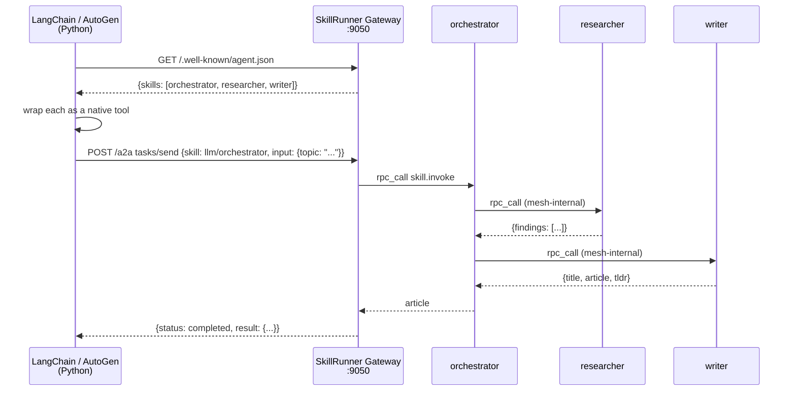

# Mycelium × LangChain / AutoGen — A2A auto-discovery

## Objective

External LangChain and AutoGen agents auto-discover what a Mycelium skill
cluster can do via the standard A2A endpoint (`/.well-known/agent.json`) and
call those skills as native tools — with **no Mycelium client**, no SDK, and no
hardcoded knowledge of which skills exist or where they run. Discovery is live:
add or remove SkillRunner nodes and the next agent-card fetch reflects the
change, no restart of the Python agent.

## How to run

See [shared setup](../README.md#shared-setup) for the Rust toolchain, Ollama,
and the Python tier. This example's specifics follow.

> **Model quality matters for tool selection.** The agent card carries each
> skill's input schema (`inputSchema`), and both demo agents build
> properly-typed tools from it — so a capable tool-calling model drives the
> whole pipeline correctly. `llama3.2` (3B) works but sometimes picks the
> wrong tool or fabricates arguments; pydantic validation catches this
> client-side before it reaches the mesh. For reliable runs use a stronger
> local model (`OLLAMA_MODEL=qwen3:14b` verified end-to-end) or
> `gpt-4o-mini` (set `OPENAI_API_KEY`).

### 1 — Build SkillRunner with A2A support

```bash
cargo build --bin skillrunner --features a2a
```

### 2 — Start the 3-skill community cluster

```bash
cd examples/community
./start.sh
```

Three SkillRunner processes start on ports 7950–7953. The orchestrator
exposes an HTTP gateway on port **9050** with A2A routes enabled.

### 3 — Install Python dependencies

```bash
pip install -r examples/a2a_langchain/requirements.txt
```

### 4 — Run the LangChain agent

```bash
# Ollama (default)
python examples/a2a_langchain/langchain_agent.py

# OpenAI
OPENAI_API_KEY=sk-... python examples/a2a_langchain/langchain_agent.py

# Custom query
QUERY="Explain Byzantine fault tolerance in one paragraph" \
    python examples/a2a_langchain/langchain_agent.py
```

### 5 — Run the AutoGen agent

```bash
python examples/a2a_langchain/autogen_agent.py
```

## What it demonstrates

The A2A (Agent-to-Agent) protocol lets any framework discover what an agent
cluster can do via a standard HTTP endpoint, then call skills via a task
endpoint (`/a2a`). Mycelium implements both sides when built with
`--features a2a` — the full concept is in the
[A2A interop guide](../../docs/guide/08-a2a-interop.md), and the mechanism is
the Axum route table in
[`src/agent/a2a.rs`](../../src/agent/a2a.rs) (`/.well-known/agent.json` →
`agent_card_handler`, `/a2a` → the task handler).

**Discovery.** `A2aClient.fetch_card()` does a single
`GET /.well-known/agent.json`. The response lists every skill `/a2a` can call —
scanned from the KV store at request time, so it is always current. The fleet's own
plumbing (provisioning tiers, shed and role marks, model metadata) and prompt skills,
which answer `llm.invoke` through `POST /gateway/llm/call`, are left out, and
`tasks/send` refuses them (2.27.0):

```
Connecting to Mycelium at http://localhost:9050 ...

  Connected to: Mycelium cluster
  Discovered 3 skill(s):
    · llm/orchestrator  Coordinates research and writing to produce articles
    · llm/researcher    Researches a topic and returns structured findings
    · llm/writer        Writes a polished article from research findings
```

**Wrapping.** Each skill becomes a Python callable wrapped as a framework tool:

```python
def tool_fn(message: str) -> str:
    return client.send(skill_id, message, timeout_secs=120.0)
```

**Invocation.** `client.send()` posts a `tasks/send` JSON-RPC request to
`/a2a`. Mycelium resolves the skill to a live node, calls it via nonce RPC, and
returns the result; if multiple nodes advertise the same skill, Mycelium picks
one automatically. From the Python agent's perspective it calls one tool and
gets back a finished result — the mesh-internal routing (orchestrator calling
researcher calling writer) is completely invisible:

```
Query: Write a short technical article about gossip protocols.

> Entering new AgentExecutor chain...
  Thought: I should use llm_orchestrator to write the article.
  Action: llm_orchestrator
  Action Input: {"topic": "gossip protocols and eventual consistency"}
  Observation: {"title": "...", "article": "...", "tldr": "..."}
  Final Answer: ...
```



## Dev notes

**`--features a2a` is required.** Without it the gateway starts but `/a2a`
and `/.well-known/agent.json` return 404.

**Timeout.** A 3-skill pipeline on CPU inference takes 60–90 s. Set
`timeout_secs=120` in `client.send()` and configure your HTTP client's
socket timeout accordingly.

**Pointing at a different cluster.** Any SkillRunner node with `http_port`
configured and `--features a2a` compiled in works as a gateway:

```bash
MYCELIUM_URL=http://my-node:8300 python langchain_agent.py
```

**Adding a skill live.** Write a `.skill.toml` and run:

```bash
./target/debug/skillrunner --skill my_skill.toml
```

It appears in `/.well-known/agent.json` within one gossip interval (~10 s).
The Python agent discovers it on the next `fetch_card()` call.

**AutoGen tool naming.** AutoGen requires `name` to be a valid Python
identifier. `autogen_agent.py` strips `/` from skill ids when registering
(`llm/orchestrator` → `llm_orchestrator`).
